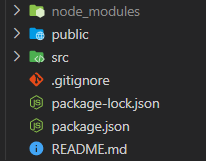
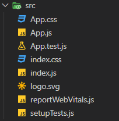

# React 기본적인 개념

## React?

- 페이스북에서 개발한 자바스크립트 기반 프론트엔드 라이브러리 UI를 만들기 위해 사용한다.

- **Virtual DOM**을 사용하며, 데이터가 자주 바뀌는 웹페이지에서 동적으로 리렌더링하는 속도가 매우 빠른 특징을 가지고 있다.

  - Virtual DOM을 알기 위해서는 먼저 DOM의 개념을 알아야 한다. 하나의 HTML 문서의 구조를 보면 최상위 태그인 HTML 태그가 존재하고, 그 밑으로 head, body 태그로 갈라지면서 트리 형태로 DOM 형태가 갈라져 나가게 된다. 웹 페이지를 구성하는 요소들을 구조화하여 나타내고, 이 객체를 이용하여 구성 요소들을 제어한다는 개념으로 이해하면 된다.

  - 하지만 DOM은 정적이다. JS를 통해 각 요소들을 조작할 수는 있지만 리랜더링하는 과정이 비효율 적이고, DOM이 복잡해질 경우에는 최적화를 감당하기가 어려워진다. DOM을 직접적으로 조작하는 것은 사용자의 PC의 자원을 더 많이 소모하게되어 웹페이지의 기능작동이 원활하게 작동하기 어려워진다.

  - 이를 해결하기위해 DOM을 추상화하여 가상의 객체를 메모리에 저장한다. 만약 데이터가 변경되어야하는 요소가 있다면 그 부분의 DOM을 찾아서 해당 부분만 업데이트하기 때문에 리랜더링의 효율성이 상승하게 된다. 이는 SPA(Single Page Application)에서의 성능 향상으로 이어질 수 있어 React가 인기가 많은 이유 중에 가장 중요한 요소라고 볼 수 있다.

- Vanila JS를 기반으로 하고 있다.

  - 기본적으로 바닐라 자바스크립트에 기반을 두고 있어서 기본적인 자바스크립트의 문법을 알고 있어야 한다.

  - 물론 자바스크립트 문법에 HTML을 작성하기위해 JSX를 사용하고, 자바스크립트 문법과 겹치게 하지않기위해 약간의 변화가 있지만 기본적인 자바스크립트에 기반을 두고 있다.

- Component를 활용한 div 태그의 구조화로 유지보수가 쉽다.

  - React는 클래스를 만들어서 각 클래스 별로 HTML 태그를 return 하도록 할 수 있다.

  - 이 점을 활용하여 한 페이지에 반복되는 태그가 있을 경우 컴포넌트를 통해 관리할 수 있어 코드의 가독성이 좋아지고, 이는 유지보수의 편리함으로 이어질 수 있다.

 

## React 파일 구성

create-react-app 라이브러리를 사용하여 React 프로젝트를 생성하면 다음과 같이 파일이 구성되어있다.

- node_modules : 라이브러리들을 모아놓은 폴더이다.
- public : 정적(static)파일들을 모아놓은 폴더이다.
- src : 소스코드들을 보관하는 폴더이다. 보통 작업을 할 때는 이 폴더에서 작업한다.
- package-json : 설치한 라이브러리의 목록을 json 형태로 보여주는 폴더이다. 아마 npm install을 입력했을 때 해당 폴더를 참고하여 사용하는 것으로 보인다..

 

src 폴더를 들어가면 다음과 같은 js 파일들이 존재한다.

- index.js : HTML에 비유하자면 index.html정도의 포지션을 가지는 파일이다. 해당 파일을 기준으로 React가 실행된다고 볼 수 있다. 호출될 때 app.js에 있는 컴포넌트들을 호출하게된다.

- app.js : 컴포넌트들을 모아놓은 자바스크립트 파일, index.js이 실행될 때 해당 파일 안에 있는 컴포넌트들을 가져와서 파일이 실행되게 된다.
