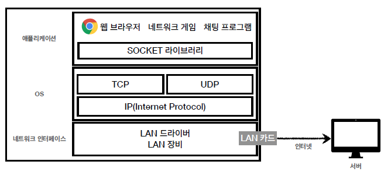
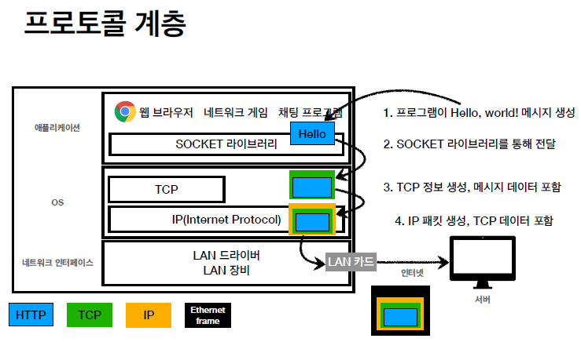
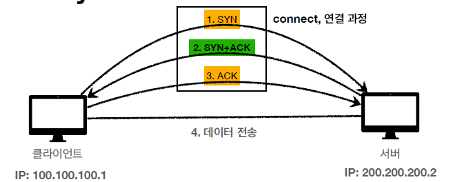
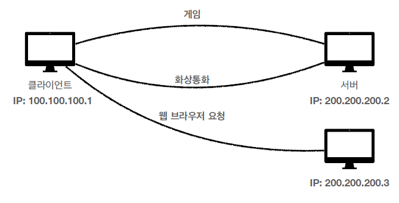
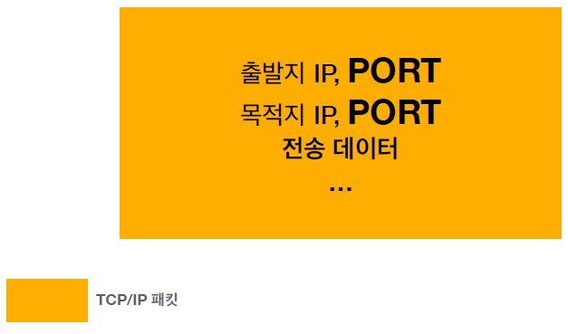
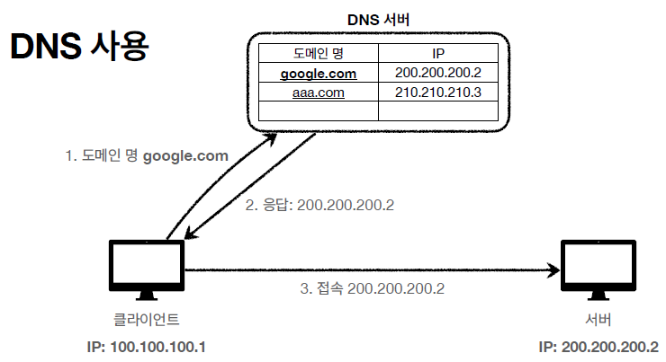

# HTTP 웹 기본 지식

## 인터넷 네트워크

웹을 개발하기 위해 알아야하는 인터넷 네트워크는 크게 5가지이다.

- 인터넷 통신
- IP(Internet Protocol)
- TCP, UDP
- PORT
- DNS

### 인터넷 통신

- 인터넷에서 컴퓨터 둘이 통신을한다고 가정해보자. 클라이언트가 서버에 Hello world라는 메시지를 보내려고 한다. 만약 클라이언트가 한국에 있고, 서버가 미국에 있을 때 클라이언트의 메시지는 수 많은 노드들을 거쳐 서버에 도착해야한다.
- 하지만 이 많은 노드들을 거쳐서 서버에 가는 동안 길을 잃지않고 목표한 지점의 서버까지 어떻게 이동할 수 있는 것일까?

### IP : 인터넷 프로토콜

- IP의 역할은 지정한 IP주소에 데이터를 전달하는 것이다. 또한 패킷이라는 통신 단위로 데이터를 전달한다.
- 패킷?
  - 패킷은 출발지IP, 목적지IP, 기타 정보들이 담겨있다.
  - 클라이언트에서 Hello world 메시지를 담은 IP 패킷을 서버로 던진다. 서버는 IP패킷을 받으면 패킷을 읽는다.
  - 서버들은 IP패킷에는 읽어오는 규약을 따르는데, 이를 통해 어떠한 클라이언트가 던진 패킷이더라도 IP 패킷을 읽을 수 있다.
  - 읽은 패킷을 노드들끼리 던지면서 최종목적지 IP가 있는 서버로 패킷을 던져준다.
- 클라이언트의 메시지를 받은 서버는 응답 패킷을 다시 클라이언트에 던져준다. 여기서 클라이언트가 서버까지 오는 노드와는 다른 루트로 전달이 될 수 있다. 어떻게든 클라이언트의 요청에 응답하기만 하는 것이 목적이다.

### IP 프로토콜의 한계

- 비연결성 : 패킷을 받을 대상이 없거나 서비스 불능 상태여도 패킷이 전송된다.
- 비신뢰성 : 중간에 패킷이 사라진다면? 패킷이 순서대로 안온다면?
  - 패킷의 용량이 클 경우에는 패킷을 쪼개서 순차적으로 보내야한다. 만약 1, 2, 3 순서대로 보냈는데 1, 3, 2순으로 도착했다면?
- 프로그램 구분 불가 : 클라이언트에서 스트리밍으로 노래를 듣고, 통화를 하고, 게임을 한다고 했을 때 해당 클라이언트 아이피에서 보낸 요청이 어떤 프로그램 왔는 지 알 수 있는지?

  

## TCP, UDP

IP프로토콜은 여러 한계점을 가지고 있다. 따라서 TCP, UDP가 더 많이 쓰인다. 어떤 장점을 가지고 있을까?

이를 알기 위해서는 인터넷 프로토콜 스택의 4계층을 먼저 알아야한다.

### 인터넷 프로토콜 스택의 4계층

- 애플리케이션 계층 : HTTP, FTP

- 전송계층 : TCP, UDP

- 인터넷 계층 : IP

- 네트워크 인터페이스 계층(랜카드, 랜드라이버 ...)

위의 사진을 보면 4계층이 어떻게 이루어져있는지 볼 수 있다. 이제 TCP가 어떻게 전송되는지를 보자.

 

1. 구동중인 어플리케이션에서 Hello world라는 메시지를 생성한다.(HTTP 방식)

2. Socket 라이브러리를 통해 데이터를 전송계층에 보낸다.

3. TCP 데이터를 생성한다. 메시지 데이터를 포함한다.

4. IP패킷을 생성하고 안에 TCP 데이터를 포함한다.(메시지도 같이 포함된다.)

5. 랜카드의 MAC 주소와 정보가 포함된 Ethernet frame을 생성하고 안에 TCP 데이터를 담는다(TMI)

IP 패킷에는 출발지 IP와 목적지 IP, 기타 정보가 담겨있다. TCP에는 출발지의 Port와 목적지 Port가 담겨있고 전송 제어, 순서, 검증 정보 등이 담겨있고 그 안에 전송 데이터가 담겨져있다.

 

## TCP 특징

TCP(image/Transfer Control Protocol)

- 연결지향 : TCP 3 way handshake(가상연결) - 먼저 상대방과 연결이 되어있는지 확인한 다음에 전송한다.
- 데이터 전달 보증 : 클라이언트에서 데이터를 전송하면 서버에서 데이트를 받았다고 회신해준다. 클라이언트에서는 데이터가 전달되었다는 점을 확인 가능하다.
- 순서 보장 : 패킷을 1, 2, 3 순서로 전송했는데 1, 3, 2 순서로 도착했을 경우 서버에서 패킷 2부터 다시 보내라고 응답한다.

위의 3가지 특징으로 인해 TCP는 신뢰할 수 있는 프로토콜이 되었다. 현재는 대부분 TCP를 사용한다. 이제 각 특징에 대해 자세히 알아보자.

### 1. TCP 3 way handshake  

1. 클라이언트가 서버에 SYN이라는 신호를 보낸다.
2. SYN 신호를 받은 서버가 클라이언트에 SYN + ACK 신호를 보낸다.
3. SYN + ACK 신호를 받은 클라이언트가 ACK 신호를 서버에 보낸다.
4. 클라이언트가 서버로 데이터를 전송한다.

여기서 SYN은 접속을 요청하는 신호이다. 클라이언트가 접속을 요청하면 서버는 접속요청과 요청 수락 신호를 같이 보낸다. 클라이언트는 요청 수락 신호를 보내게 되면 서로 연결이 가능하다는 뜻이므로 그제서야 클라이언트는 데이터를 전송하기 시작한다. (ACK 신호를 보내면서 같이 전송하기도 한다.)

 

### 2. 데이터 전달 보증

TCP는 클라이언트가 데이터를 서버에 보내면 서버에서 데이터를 받았다는 응답을 보낸다. IP 패킷의 경우에는 클라이언트가 데이터를 보내도 서버에서 받았다는 응답을 받지 못한다. 클라이언트에서는 데이터가 제대로 전송이 되었는 지 알 수가 없다. 신뢰성을 보장받지 못한다.

 

### 3. 순서 보장

클라이언트에서 TCP 프로토콜로 패킷을 쪼개서 1, 2, 3 순으로 보냈는데 1, 3, 2순으로 서버에 도착했다. 이럴 경우 서버에서는 TCP 정보를 읽고, 순서가 다르게 보내진 점을 인지하고 클라이언트에게 2번 패킷부터 다시 보내라고 응답을 보내게 된다.

 

## UDP 특징

사용자 데이터그램 프로토콜(User Datagram Protocol)

- UDP는 하얀 도화지에 비유할 수 있다.(기능이 거의 없음)
- TCP의 3way handshake 같은 연결지향적인 기능이 없다.
- 데이터 전달 보증이 안된다.
- 순서 보장이 안된다.
- 하지만 구조가 단순하고 빠르다.

UDP는 IP와 거의 같다고 보면 된다. 하지만 여기에 Port 정보와 체크섬 정보는 포함하고 있는게 차이점이다. 따라서 UDP를 사용하기 위해서는 애플리케이션에서 추가작업이 필요하다.

 

## Port

TCP에 담기는 정보중에 Port가 있었다. port에 대해서 알아보자.

  

클라이언트가 게임, 화상통화, 웹 브라우저 각각 다른 프로그램들을 사용중이다. IP 프로토콜의 경우에는 요청을 보내도 IP만 적혀있어 어떤 프로그램에서 온 요청인지를 알 수 없다. 게임과 화상통화는 같은 서버를 공유하고 있어서 어느쪽으로 응답을 보내야될지 서버측에서 알 방법이 없다.

  

위 사진은 TCP와 IP 패킷을 합친 것이다. TCP/IP에는 출발지 PORT, 목적지 PORT가 포함되어 있는데 아이피 뒤에 :0000 방식으로 붙여져 있다. 프로그램마다 포트번호를 다르게 해서 어디서 온 요청인지 구분할 수 있게 해준다.

### Port 특징  

Port는 항구라는 뜻을 가지고 있다. IP가 아파트라면, Port는 동, 호수를 의미한다. 포트를 통해 어떤 애플리케이션에서 온 요청인지 구분짓고, 서버에스는 해당 포트로 다시 응답해주면 되어 데이터가 충될되지 않게 해준다.

- 0 ~ 65535 할당 가능
- 0 ~ 1023 : 잘 알려진 포트로 사용하지 않는 것이 좋다.
  - FTP : 20, 21
  - TELNET : 23
  - HTTP : 80
  - HTTPS : 443

 

## DNS (Domain Name System)

ip 주소는 숫자로 되어있어 기억하기가 어렵고 입력하기도 번거롭다. 또한 유동적인 ip를 사용할 경우에는 ip의 값이 변경될 수도 있다. 이렇게 될 경우 개발할 때 새로운 아이피 주소를 다시 작성해주어야 한다.

이러한 단점을 보완하기위해 DNS가 등장하였다. DNS는 전화번호부라고 볼 수 있는데, IP 주소를 도메인 명으로 변환하는 시스템이다.

