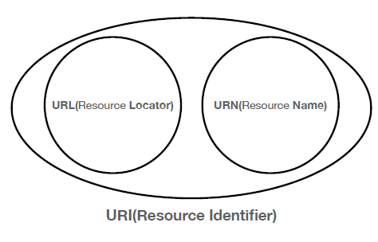
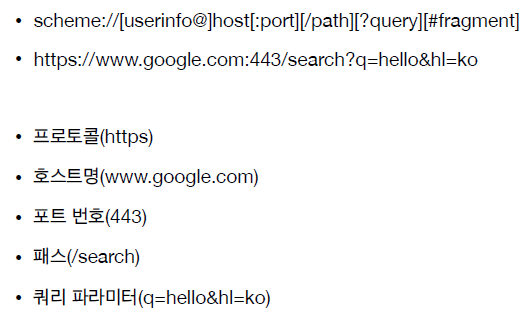
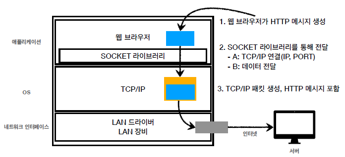
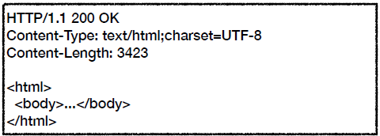

# HTTP 웹 기본 지식 2

## URI? URL? URN?

웹 공부를 하면서 URI, URL은 흔하게 들어보았으나 URN은 처음 들어봤다. 세 키워드의 차이점이 무엇인지 알아보자.

### URI

URI(Uniform Resource Identifier)는 리소스를 식별하는 통합된 방법이다.

- Uniform : 리소스를 식별하는 통일된 방식
- Resource : 자원, URI로 식별할 수 있는 모든 것(제한없음)
- Identifier : 다른 항목과 구분하는데 필요한 정보

URI는 로케이터(locator), 이름(name) 또는 둘 다 추가로 분류될 수 있다, 즉 URI 안에 URL이 있는 것이고, URN이 있는 것이다.

### URL

URL은 Unifrom Resource Locator로, 우리가 흔히 볼 수 있는 주소창에 입력하는 그것이다. URL은 웹 애플리케이션의 리소스가 위치한 장소를 표시한다.

### URN

URN은 Unifrom Resource Name으로, 리소스에 이름을 부여한 것이다. 자주 사용되지는 않는다. 예를 들자면 책의 isbn urn을 예로 들 수 있다. 서점에 가면 뒷표지에 isbn과 바코드가 찍혀있는데, 책(리소스)의 고유한 식별자를 나타낸다.

> 위치는 변할 수 있지만 이름은 변하지 않는다. 하지만 URN이름 만으로 실제 리소스를 찾을 수 있는 방법이 보편화 되지는 않았다.

 

## URL(URI) 분석하기

https://www.google.com/search?q=hello&hl=ko

위의 URL의 구조를 살펴보자.

[URL scheme]

scheme://[userInfo@]host[:port][/path][?query][#fragment]

https://www.google.com:443/search?q=hello&hl=ko

[scheme] : 주로 프로토콜을 사용한다.

- 프로토콜 : 어떤 방식으로 자원에 접근할 것인가 하는 약속규칙(http, https, ftp 등)

- https는 80포트, https는 443 포트를 주로 사용한다. 포트는 생략이 가능하다.

- https는 http에 보안을 추가한다(HTTP Secure)

[userInfo@]

- url에 사용자 정보를 포함해서 인증, 거의 사용하지 않는다.

[host]

- 호스트명. 도메인명 또는 IP주소를 직접 사용 가능하다.

[Port]

- 접속 포트. 일반적으로 생략한다. 생략 시 http는 80, https는 443으로 자동설정된다.

[path]

- 리소스경로(path), 계층적 구조
- ex) /home/file.jpg, /members, /members/100, /items/iphone12

[?query]

- key=value 형태로 되어있다.
  ?로 시작하고 &로 추가가 가능하다. ?keyA=valueA&keyB=valueB
  query parameter, query string 등으로 불린다. 웹서버에서 제공하는 파라미터, 문자 형태이다.

[#fragment]

- html 내부 북마크 등에 사용한다. 서버에 전송하는 정보는 아니다.

 

## 웹 브라우저 요청 흐름

https://www.google.com/search?q=hello&hl=ko

위의 URL 구조를 요청한다고 했을 때 전체적인 흐름을 살펴보자.

1. HTTPS 프로토콜을 사용한다는 점을 체크. 포트는 443으로 자동 할당된다.
2. 호스트가 www.google.com이다. IP로 변환하니 200.200.200.2가 나옴(가정)
3. path = search
4. 쿼리문 q=hello , hl=ko 로 되어있다.

위의 URL을 입력하게 되면 웹 브라우저는 해당 도메인 주소를 IP, 포트로 바꾸고 요청 메시지를 생성한다.

> GET /search?q=hello&hl=ko HTTP/1.1
> Host: www.google.com

 

인터넷 프로토콜 4계층을 통해 HTTP 메세지가 담긴 패킷을 만들고, 서버로 전송한다.
요청 메시지를 받은 서버는 이제 해당 URL에 있는 리소스를 응답메시지로 전달해준다.

 

응답할 메시지는 위와 같다. html을 클라이언트에 보내주면 웹 브라우저가 렌더링을 통해서 해당 URL의 화면을 출력해준다.

 

## [웹 브라우저 요청 전체적인 흐름 총 정리]

1. resource 요청 시, 웹 브라우저가 HTTP 메시지 생성

2. SOCKET 라이브러리를 통해 TCP/IP로 3way handshake를 실행해 서버와 연결한다.

3. 운영체제 TCP/IP 계층으로 데이터 전송을 하기 위해 데이터를 전달한다.

4. HTTP 메시지가 포함된 TCP/IP 패킷을 생성한다.

5. 패킷 정보가 인터넷으로 흘러간다.

6. 서버에 요청 패킷이 도착하여 패킷 껍데기는 버리고 HTTP 메시지를 서버가 해석한다.

7. HTTP 응답 메시지를 마찬가지 방식으로 패킷을 생성하여 응답 패킷을 전달한다.

8. 수 많은 노드들을 통해서 응답 패킷이 도착하게 되면 웹 브라우저가 HTML 렌더링하여 화면에 보여준다.
