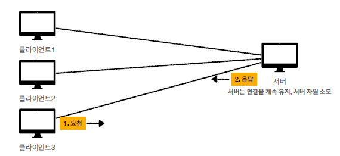
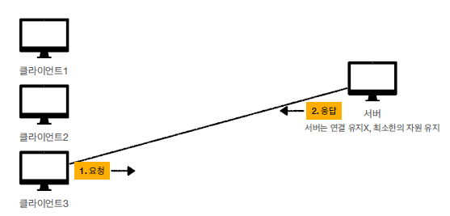
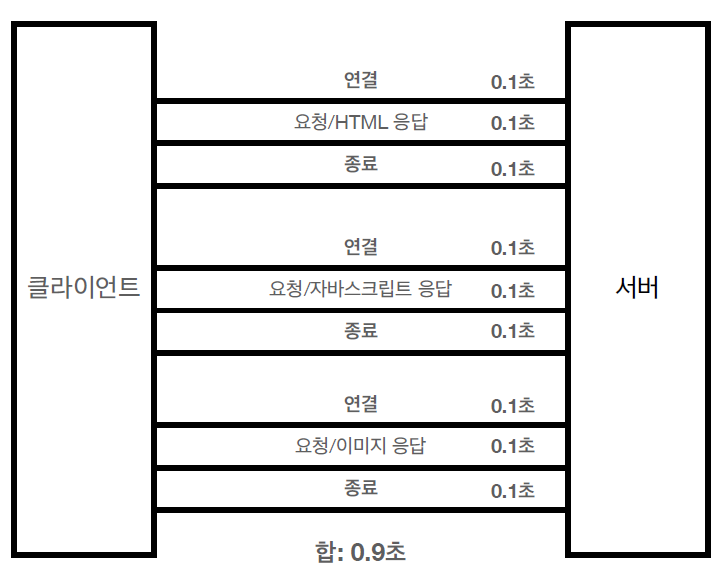
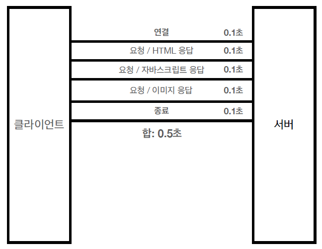
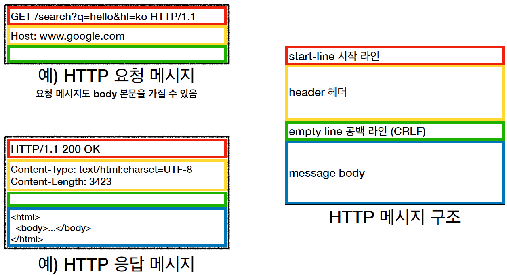
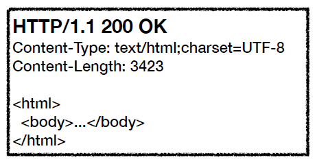
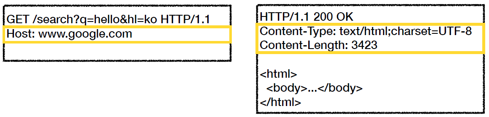
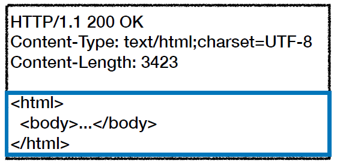

# HTTP 웹 기본 지식 3

## HTTP

### HTTP 메시지에 모든 것이 전송 가능

- HTML, TEXT
- IMAGE, 음성, 영상 파일
- JSON, XML(API)
- 거의 모든 형태의 데이터 전송이 가능
- 서버 간에 데이터를 주고 받을 떄도 대부분 HTTP를 사용

### HTTP의 역사

- 1991년 : HTTP/0.9 - GET 메서드만 지원, HTTP 헤더 X
- 1996년 : HTTP/1.0 - 메서드와 헤더 추가됨
- 1997년 : HTTP/1.1 - 가장 많이 사용하고, 가장 중요한 버전이다.
- 2015년 : HTTP/2 - 성능 개선
- 현재진행중 : HTTP/3 - TCP 대신 UDP를 사용함, 성능 개선

가장 중요한 버전은 HTTP 1.1이다. 1.1 버전에서 대부분의 기능들을 가지고 있고, 이후의 버전들은 성능 개선에 초점을 맞추어서 업데이트되고 있다.

현재 1.1 버전을 가장 많이 사용하고 있으며, 1.1 버전에 대한 개정은 2014년에 이루어진 RFC7235이다.

### HTTP의 특징

- 클라이언트 서버 구조
- 무상태 프로토콜(Stateless), 비연결성
- HTTP 메시지
- 단순함과 확장가능성

 

## 무상태 프로토콜

### Stateless

- 서버가 클라이언트의 상태를 보존하지 않는 것.
- 장점은 서버의 확정성이 높다.(스케일 아웃)
- 단점은 클라이언트가 추가 데이터를 전송한다는 점

 

### Stateful, Stateless의 차이점

Stateful이 어떤 방식인지 다음 대화를 살펴보자

> 고객 : 이 노트북 얼마인가요?

> 점원 : 100만원 입니다.

> 고객 : 2개 구매하겠습니다.

> 점원 : 200만원입니다. 신용카드, 현금 중에 결제수단을 선택해주세요.

> 고객 : 신용카드로 구매하겠습니다.

> 점원 : 200만원 결제완료 되었습니다.

대화를 보면 처음부터 끝까지 내용이 이어지고 있다. 대화내용의 중간부분을 자르면 대화의 흐름을 이해할 수가 없을 것이다. 만약 점원이 중간에 바뀐다면 어떻게 될지 보자.

> 고객: 이 노트북 얼마인가요?

> 점원A: 100만원 입니다.

> 고객: 2개 구매하겠습니다.

> 점원B: ? 무엇을 2개 구매하시겠어요?

> 고객: 신용카드로 구매하겠습니다.

> 점원C: ? 무슨 제품을 몇 개 신용카드로 구매하시겠어요?

Stateful은 상태가 유지되는 것으로, 고객이 노트북을 산다고 말하면서 노트북이 상태유지되고, 2개를 산다고 말하면서 상태유지가 되고, 신용카드로 결제한다고 이야기하면서 데이터의 전송이 마무리 된다. 데이터를 처리하기까지 서버와 클라이언트가 계속 연결이 유지되어있어야하고, 중간에 서버가 바뀌면 어떤 데이터가 유지되고 있었는지 알 수 없게된다.

이제 Stateless를 알아보자.

> 고객: 이 노트북 얼마인가요?

> 점원A: 100만원 입니다.

> 고객: 노트북 2개 구매하겠습니다.

> 점원B: 노트북 2개는 200만원 입니다. 신용카드, 현금중에 어떤 걸로 구매 하시겠어요?

> 고객: 노트북 2개를 신용카드로 구매하겠습니다.

> 점원C: 200만원 결제 완료되었습니다.

무상태는 고객이 구매하려는 모든 데이터 정보를 가지고 있어서 서버가 바뀌더라도 비즈니스 로직의 처리가 가능해진다. 모든 데이터를 담고 있어서 데이터가 무거워지는 단점을 가지고 있지만, 서버 입장에서는 서버 증설이 가능해지고, 갑자기 몰리는 트래픽을 방지할 수 있어서 더 선호되는 상태이다.

 

### Stateful, Stateless 정리

- Stateful(상태유지) : 중간에 다른 점원으로 바뀌면 안된다. (중간에 다른 점원으로 바뀔 때 상태 정보를 다른 점원에게 미리 알려줘야 한다.)

- Stateless(무상태) : 중간에 다른 점원으로 바뀌어도 된다.

  - 갑자기 고객이 증가해도 점원을 대거 투입할 수 있다.
  - 갑자기 클라이언트 요청이 증가해도 서버를 대거 투입할 수 있다.

- Stateless는 응답서버를 쉽게 바꿀 수 있어서 무한한 서버 증설이 가능해진다.
  이를 스케일 아웃(scale out)이라고 하는데, 무상태 요청정보를 클라이언트가 가지고 있어서 이를 읽을 수 있는 서버만 늘려주면 되기 때문에 대응하기가 훨씬 수월해진다.

하지만 Stateless는 한계점을 가지고 있다. 대표적으로 로그인이다. 클라이언트에서 로그인을 했을 경우 서버에서는 로그인을 했다는 상태를 서버에 유지해야 다른 서비스들을 이용할 수 있다.

일반적으로 브라우저 쿠키와 서버 세션등을 사용해서 상태를 유지한다. 상태유지는 최소한만 사용하는 것이 좋다.

또한 Stateful에 비해서 Stateless는 데이터를 한 번에 많이 보낸다느 점도 단점이라할 수 있다.

결론은 Stateless의 최대장점은 트래픽이 몰리더라도 서버를 왕창늘려도 비즈니스 로직을 처리하는데 문제가 없다는 것이다. 클라이언트 측에서 정보를 A부터 Z까지 가지고 있기 때문에 서버측에서 정보를 읽는데 문제가 없다. 이러한 메리트 때문에 Stateless로 설계하는 것이 좋다.

 

## 비연결성(Connectionless)

기본적으로 웹 애플리케이션이 가동되면 서버는 클라이언트와 연결을 유지한다. 클라이언트가 요청을 보내지 않더라도 서버는 요청이 올때까지 계속 연결을 유지시킨다. 연결이 계속 유지될수록 서버의 자원은 지속적으로 소모되어 좋지 않다.

비연결성은 클라이언트와 서버 간에 쵸엉이 없을 경우에는 연결을 끊고 클라이언트의 요청이 들어오면 그때 다시 연결을 하는 것을 말한다. 이럴 경우에는 서버는 최소한의 자원으로 서버를 유지할 수 있게 된다.

HTTP는 기본이 연결을 유지하지 않는 모델이다. 일반적으로 초 단위 이하의 빨느 속도로 응답하기 때문에 1시간동안 수 천명이 서비스를 사용해도 실제 서버에서 동시에 처리하는 요청은 수 십개 이하로 매우 적다.(브라우저가 랜더링하면 정보를 얻어오는 시간이 있기 때문)

그렇다면 비연결성의 단점은 무엇일까? 요청과 응답이 이루어지면 연결을 끊어버리기 때문에 다시 요청을 하기 위해선 새로 TCP/IP 연결을 맺어야한다는 점이다. 우리는 위에서 TCP/IP가 연결되는 과정을 보았다. 3 way handshake를 매 번 수행해야한다는 점은 별로 좋아보이지 않는다.

또한 웹 브라우저로 사이트를 요청하면 HTML 뿐만 아니라 JS, CSS, 이미지 등 수 많은 자원들이 같이 다운로드가 된다. 하나 씩 받게되면서 연결과 종료를 반복하게 되는 것이다. 지금은 Persistent Connections(지속연결)을 통해 문제를 해결하였다.

지속연결을 할 경우에는 HTML, JS, CSS 이미지들을 모두 다운받을 때 까지 연결을 지속한다. 모든 리소스들을 다 받은 다음에 연결이 종료되어 효율적인 서버자원활용을 가능하게 한다.

 

## HTTP 메시지

이전 강의에서 HTTP를 요청하고 응답이 어떻게 이루어지는 지 전체적인 흐름을 살펴보았다. 이번에는 HTTP 메시지가 어떤 구조를 가지고 있는지를 알아본다.

HTTP의 메시지 구조는

- start-line(시작라인)
- header(헤더)
- empty line(공백라인) (CRLF : 엔터) : 꼭 있어야하는 라인
- message body(바디태그) : 올 수도 있고 안 올수도 있다.

총 네 가지가 있다.

 

### 요청 메시지 구조

- start-line = request-line
- request-line = method SP(공백) request-target SP HTTP-version CRLF(엔터)

하나 씩 천천히 살펴보자. 먼저 요청 메시지는 시작 라인이 요청라인으로, 요청 라인은

> 메서드 요청대상 HTTP버전

으로 이루어져 있다. 공백은 무조건 띄어쓰기를 해주어야한다.

1. HTTP메서드

   - 종류는 GET, POST, PUT, DELETE 등이 있다.
   - 서버가 수행해야할 동작을 지정한다. (GET: 리소스 조회, POST: 요청 내역 처리)

2. 요청대상

   - 구성은 absolute-path[?query]로 구성되어있다. (절대경로[?쿼리])
   - 여기서 절대경로는 "/"로 시작하는 경로를 말한다.

3. HTTP 버전 : 말 그대로 HTTP 버전을 나타낸다.

 

### 응답 메시지 구조

- start-line = status-line
- status-line = HTTP-version SP status-code SP reason-phrase CRLF

응답 메시지는 총 3개로 이루어져 있다.

> HTTP버전 HTTP상태코드 이유문구

1. HTTP 버전 : 말 그대로 HTTP 버전을 나타냄

2. HTTP 상태 코드 : 요청 성공, 실패를 나태낸다.

   - 200 : 성공
   - 400 : 클라이언트 요청 오류
   - 500 : 서버 내부 오류

3. 이유 문구
   - 사람이 이해할 수 있는 짧은 상태 코드를 설명하는 글

 

### HTTP 헤더

- header-field = field-name ":" OWS field-value OWS (OWS : 띄어쓰기 허용)

- field-name은 대소문자 구분이 없다.

- 용도
  - HTTP 전송에 필요한 모든 부가정보를 담는다.(메시지 바디의 내용, 크기, 압축, 인증, 요청 클라이언트의 정보...)
  - 표준 헤더가 너무 많다는 점이 특징
  - 필요시에는 임의의 헤더가 추가 가능하다.

 

### HTTP 메시지 바디

- 실제로 전송할 데이터가 담겨있다.
- HTML 문서, 이미지, 영상 JSON 등 byte로 표현할 수 있는 모든 데이터를 전송할 수 있다.

 

## HTTP 정리

- HTTP 메시지에 모든 것을 전송할 수 있다.
- HTTP버전은 1.1을 기준으로 한다. 이후 버전은 성능 개선에 초점이 맞춰져 있다.
- 클라이언트와 서버 구조는 요청과 응답을 통해 이루어진다.
- 무상태 프로토콜(Stateless)의 특징에 대해 알아두기
- HTTP 메시지의 구조(요청, 응답)
- HTTP는 단순하고 확장이 가능한 특징을 가지고 있다.
