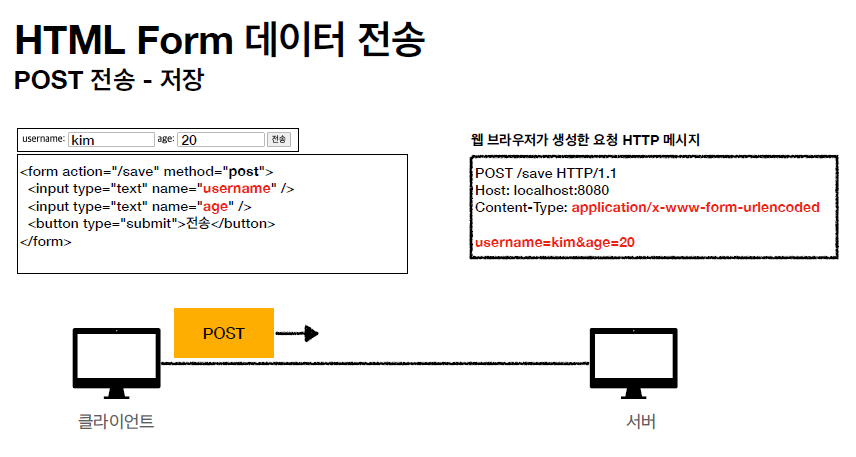

# HTTP 웹 기본 지식 4

## HTTP API 설계

HTTP API를 설계한다고 가정해보자, 회원목록 조회, 회원 조회, 회원 등록, 회원 수정, 회원 삭제를 구현한다고 했을 때,

- 회원 목록 조회 /read-member-list

- 회원 조회 /read-member-by-id

- 회원 등록 /create-member

- 회원 수정 /update-member

- 회원 삭제 /delete-member

위의 URI를 좋은 설계라고 말할 수 있을 까? HTTP API 설계 시 가장 중요한 점은 리소스를 식별할 수 있어야 한다는 점이다.

> 회원을 등록하고 수정하고 조회하는 것이 리소스가 아니다. 회원이라는 개념 자체가 리소스이다. 주어에 포커스를 두어야 한다. 회원이라는 리소스만 식별하여 회원 리소스를 URI에 매핑하는 것이 올바른 HTTP API의 설계이다.

URI는 리소스만 식별하도록 하게한다. 리소스와 해당 리소스를 대상으로하는 행위를 분리해야한다. 주어와 동사를 분리해서 설계해야한다는 것이다.

그렇다면 이제 정리해보자.

- 리소스 : 회원
- 행위 : 조회, 등록, 삭제 변경(동사)

리소스는 명사, 행위는 동사가 된다. 그렇다면 이제 배운 내용을 바탕으로 URI 설계를 다시해보자.

- 회원 목록 조회 /members

- 회원 조회 /members/{id}

- 회원 등록 /members/{id}

- 회원 수정 /members/{id}

- 회원 삭제 /members/{id}

(계층 구조 상 상위를 컬렉션으로 보고 복수단어 사용을 권장한다.)

일단 배운내용대로 리소스(회원)를 중심으로 URI를 설계하였다. 그렇다면 조회, 등록, 수정, 삭제를 어떤 방법으로 구분할 지가 궁금해질 것이다. **HTTP 메서드**를 통해 이를 구분하는 것이 가능하다.

 

## HTTP 메서드의 종류

- GET : 리소스 조회
- POST : 요청 데이터를 처리, 주로 등록에 사용
- PUT : 리소스를 대체한다, 해당 리소스가 없으면 생성한다.
- PATCH : 리소스를 부분적으로 변경한다.
- DELETE : 리소스를 삭제한다.

### 기타 메서드 : HEAD, OPTIONS, CONNECT, TRACE 가 있다. (사용빈도 낮음)

 

### GET

- 리소스를 조회하는 메서드
- 서버에 전달하고 싶은 데이터는 **query(쿼리파라미터, 쿼리스트링)**를 통해서 전달한다.
- 메시지 바디를 사용해서 데이터를 전달할 수 있지만 지원하는 곳이 적다.

 

### POST

- 요청 데이터를 처리한다.
- **메시지 바디를 통해** 서버로 요청 데이터를 전달한다.
- 서버는 요청 데이터를 처리하고, 메시지 바디를 통해 들어온 데이터를 처리하는 모든 기능을 수행한다.
- 서버는 주로 전달된 데이터를 통해 **신규 리소스를 등록**하고, 프로세스 처리에 사용한다.

리소스 URI에 POST 요청에 오면 요청 데이터를 어떻게 처리할 지 리소스마다 따로 정해야한다. (POST는 따로 정해진게 없다는 뜻이다.)

POST는 회원가입, 주문하기, 게시판 글쓰기, 댓글달기, 신규 주문 생성, 기존 자원에 데이터 추가와 같이 새로운 리소스를 생성하거나 입력 폼을 통해 데이터를 전달하여 서버에서 처리할 수 있는 작업을 할 때 사용되는 메서드이다. 다른 메서드를 사용하기 애매할 경우에는 POST를 사용할 정도로 거의 모든 데이터처리를 할 때 사용될 수 있는 메서드이다.

[정리]

1. 새 리소스 생성(등록)
   - 서버가 아직 식별하지 않은 새 리소스를 생성해준다.
2. 요청 데이터를 처리
   - 단순히 데이터를 생성하거나, 변경하는 것을 넘어 프로세스를 처리해야하는 경우에 해당한다.
   - 주문의 경우 결제완료 > 배달 시작 > 배달완료처럼 단순히 값 변경을 넘어 프로세스의 상태가 변경되는 경우에도 POST를 사용한다.
   - POST의 결과로 새로운 리소스가 생성되지 않을 수도 있다.
3. 다른 메서드로 처리하기 애매한 경우 POST를 사용한다.
   - ex. JSON으로 조회 데이터를 넘겨야하는데 GET메서드를 사용하기 어려운 경우
     사용

 

### PUT

- 리소스를 완전히 대체한다.

  - 리소스가 있으면 대체한다.
  - 리소스가 없으면 생성한다.
  - 리소스를 덮어씌운다고 생각하면 된다.

- **클라이언트가 리소스를 식별한다**
  - 클라이언트가 리소스 위치를 알고 URI를 지정한다.
  - POST와의 차이점이다. POST는 서버에서 리소스를 지정하지만 PUT은 클라이언트에서 지정한다.

여기서 리소스를 완전히 대체한다는 점에 주목해야한다. 예를 들어서 ID가100인 회원의 나이를 수정하기위해 "AGE" : 20을 PUT 메서드로 보낸다고 했을 때 서버에서는 ID 100에 "NAME" : STEVE, "AGE" : 50 이 저장되어있다면 서버의 데이터는 "AGE" : 20으로 완전히 대체된다. 이름이 누락되어버리는 것이다. 따라서 PUT을 사용할 경우 신중하게 입력 폼을 작성하는 것이 필요하다.

 

### PATCH

- 리소스를 부분변경한다.

PUT이 데이터를 완전 대체한다고 하면 PATCH는 부분변경이다. 위의 예시를 다시 참조하면, "AGE" : 20을 서버에 보내면 서버의 데이터는 "NAME" : STEVE, "AGE" : 20이 된다. NAME 데이터가 유지된다.

 

### DELETE

- 리소스를 삭제한다.

 

## HTTP 메서드의 속성

HTTP 메서드를 보기 전에 유의해야할 점 : **해당 리소스만 고려**한다. 외부적인 요인은 고려하지 않는다.

- 안전(Safe Methods) : 호출해도 리소스가 변경되지 않음(GET, HEAD)

- **멱등(Idempotent Methods)** : 한 번 호출하든 두 번 호출하든 100번 호출하든 결과가 같다.

  - GET : 한 번 조회하든 두 번 조회하든 같은 결과가 조회된다.
  - PUT : 결과를 대체한다. 따라서 같은 요청을 여러 번 해도 대체된 결과를 출력하기 때문에 최종적인 결과는 같다.(리소스 자체만 따져봐야한다. 대체되는 과정은 포함하지 않음.)
  - DELETE : 결과를 삭제하면 그 리소스는 지워진다. 삭제된 결과는 같다.
  - **POST** : 두 번 호출하면 같은 결제가 중복해서 발생할 수 있다. 멱등에 해당되는 부분

- 캐시가능(Cacheable Methods) : 응답결과 리소스를 캐시해서 사용해도 되는지의 여부
  - GET, HEAD, POST, PATCH는 캐시가 가능하다.
    - 실제로는 GET, HEAD 정도만 캐시로 사용한다. POST, PATCH는 본문 내용까지 캐시 키로 고려해야한다. 하지만 구현이 쉽지 않다.

 

## HTTP 메서드 활용

이제 HTTP 메서드를 활용해보도록 하자. 클라이언트에서 서버로 데이터를 전송해야하는 상황에서 HTTP API를 설계하는 예시를 들어볼 것이다.

### 클라이언트에서 서버로 데이터를 전송하는 방식

- 쿼리 파라미터를 통한 데이터 전송(GET) : 주로 정렬 필터에 사용한다.(검색어)
- 메시지 바디를 통한 데이터 전송(POST, PUT, PATCH) : 회원가입, 상품주문, 리소스 등록, 리소스 변경에 주로 사용되어진다.

데이터를 전송하는 상황은 4가지의 상황으로 구분한다.

- 정적 데이터 조회

  - 이미지, 정적 테스트 문서

- 동적 데이터 조회

  - 주로 검색, 게시판 목록에서 정렬 필터(검색어)

- HTML form을 통한 데이터 전송

  - 회원가입, 상품주문, 데이터 변경

- HTTP API를 통한 데이터 전송
  - 회원가입, 상품주문, 데이터 변경
  - 서버 to 서버, 앱 클라이언트, 웹 클라이언트(AJAX)

 

### 정적 데이터 조회

- 이미지나 정적 텍스트 문서를 조회
- 조회는 GET 방식을 사용한다.
- 정적 데이터는 일반적으로 **쿼리 파라미터 없이 리소스 경로로 단순하게 조회**가 가능하다.

 

### 동적 데이터 조회

- **쿼리 파라미터를 사용**

- /search?q=hello&hl=ko
  - uri뒤에 있는 쿼리파라미터를 통해서 쿼리 파라미터에 따른 응답 결과를 다르게 출력하는 동적인데이터를 조회한다.
  - 조회 조건을 줄여주는 필터, 조회 결과를 정렬하는 정렬 조건에 주로 사용한다. 조회는 GET방식을 사용한다.

 

### HTML Form 데이터 전송 : POST 방식

- POST 방식은 URI에 쿼리파라미터가 존재하지 않는다. 대신 form 태그에 입력한 내용을 key와 value의 형태로 요청메시지의 **메시지바디 부분에 담아서** 보내게 된다.

- Content-type : application/x-www-form-urlencoded
  - POST 방식으로 데이터를 전송할 경우 요청 HTTP 메시지의 Content type은 application/x-www-form-urlencoded로 설정되어 보내진다.
- **GET은 조회에서만 사용한다. 만약 form 태그로 입력한 데이터를 GET을 통해서 보내면 쿼리파라미터를 통해 보내게 된다. 좋지않다.**

- enctype="multipart/form-data" : 여러 Content-type의 데이터를 보낼 수 있게 해주는 인코딩 타입이다. form 태그에서 enctype 속성에 "multipart/form-data"를 입력하면 요청 메시지가 위의 사진처럼 입력되는데, 주로 바이너리 데이터를 전송할 때 사용된다.

 

## HTTP API 데이터 전송

- 아이폰은 클라이언트에서 서버로 바로 전송을 해야한다. 이럴 때 HTTP API 데이터를 사용한다.
- 서버 to 서버 : 백엔드 시스템 통신이다.
- 앱 클라이언트 : 아이폰, 안드로이드에서만 사용한다.
- 웹 클라이언트 : HTML에서 Form 전송 대신 자바 스크립트를 통한 통신에 사용한다(AJAX) > React, Vue.js와 같은 웹 클라이언트와 통신
- POST, PUT, PATCH : 메시지 바디를 통해 데이터를 전송한다.
- GET : 조회, 쿼리파라미터로 데이터를 전달한다.
- Content-Type: application/json을 주로 사용한다(사실 상 표준) > TEXT, XML, JSON 등등

 

# HTTP 설계 예시 (컬렉션, 스토어, 컨트롤 URI)

HTTP API를 설계하는 예시를 통해 HTTP 데이터 전송 시 사용되는 개념들을 익혀본다.

 

## 회원관리 시스템 : POST

다시 회원 리소스로 돌아가보자, 배운 내용을 바탕으로 이제 회원 리소스로 CRUD를 어떻게 설계해야되는지 알았다.

- 회원 목록 /members : GET
- 회원 등록 /members : POST
- 회원 조회 /members/{id} : GET
- 회원 수정 /members/{id} : PATCH, PUT, POST
- 회원 삭제 /members/{id} : DELETE

우리가 봐야할 건 회원 등록이 POST 기반으로 등록된다는 점이다. POST는 신규 자원을 등록할 때 사용할 수 있는데, 몇 가지 특징을 가지고 있다.

- **클라이언트는 등록될 리소스의 URI를 모른다.**

  - 회원 등록 /members : POST
  - POST /members

- **서버가 새로 등록된 리소스 URI를 생성**해준다.

  - HTTP/1.1 201 Created
  - Location : /members/100

- 이 개념을 **컬렉션(Collections)**이라고 한다.
  - 서버가 관리하는 리소스 디렉토리
  - 서버가 리소스의 URI를 생성하고 관리
  - 여기서 컬렉션은 /members가 된다.

클라이언트는 그냥 /members URI로 등록할 데이터를 전송하고, 서버가 생성된 회원의 URI를 /members/100과 같이설정한다.

 

## 파일관리 시스템 : PUT

이번에는 파일 관리 시스템을 구현한다고 가정해보자, 파일 목록, 파일 조회, 등록, 삭제, 대량 등록을 구현한다고 했을 때,

- 파일 목록 /files -> GET
- 파일 조회 /files/{filename} -> GET
- 파일 등록 /files/{filename} -> PUT
- 파일 삭제 /files/{filename} -> DELETE
- 파일 대량 등록 /files -> POST

다음과 같이 구현할 수 있다. 파일을 등록할 때 PUT 방식을 사용하고, 대량 등록할 때 POST방식을 사용하는데, 어떤 특징이 있는 지 알아보자

 

### PUT 신규자원 등록 특징

- **클라이언트가 리소스 URI를 알고있다.**

  - 파일 등록 /files/{filename} > PUT
  - PUT /files/star.jpg

- **클라이언트가 직접 리소스의 URI를 지정**한다.

- 이 개념을 **스토어(Store)**라고 한다.
  - 클라이언트가 관리하는 리소스 저장소이며
  - 클라이언트가 리소스의 URI를 알고 관리한다.
  - 스토어의 리소스는 /files

간단히 생각해보자, 파일을 업로드 할 때는 로컬파일의 위치가 클라이언트에 있으므로 클라이언트에서 업로드를 해야된다. 클라이언트에서 파일을 업로드 할 때 파일의 위치를 서버에서 미리 지정할 순 없다. 서버는 파일을 받은 다음 DB에 저장을 해야하기 때문에 주도권은 클라이언트에게 있다.

따라서 클라이언트 리소스의 URI를 먼저 지정을 하고 서버에 전달하게된다.

 

### HTML FORM 사용

- HTML FORM은 GET과 POST 방식만 지원한다.
- AJAX 같은 기술을 사용해서 한계를 극복할 수 있다.
- 여기서는 순수 HTML FORM만 언급한다.
- GET, POST 방식만 지원하므로 제약이 있다.

위의 회원목록을 HTML FORM 만 사용하여 개발한다고 가정해보자,

- 회원 목록 /members -> GET
- 회원 등록 폼 /members/new -> GET
- 회원 등록 /members/new, /members -> POST
- 회원 조회 /members/{id} -> GET
- 회원 수정 폼 /members/{id}/edit -> GET
- 회원 수정 /members/{id}/edit, /members/{id} -> POST
- 회원 삭제 /members/{id}/delete -> POST

URI를 보면 GET과 POST로만 구현을 해야하기 때문에 어쩔 수 없이 리소스 외에 동사를 사용하여 URI를 설계한 것을 볼 수 있다.

이 개념을 **컨트롤 URI**라고한다.

- GET, POST만 지원하므로 제약이 있음
- 이런 제약을 해결하기위해 동사로 된 리소스 경로를 사용
- POST의 /new, /edit, /delete가 컨트롤 URI
- HTTP 메서드로 해결하기 애매한 경우에 사용된다.
