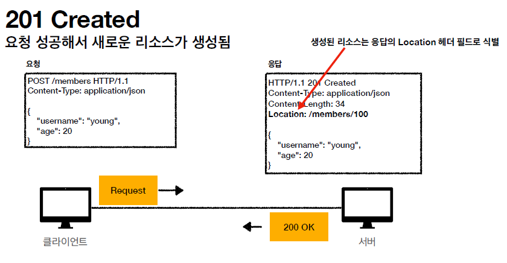
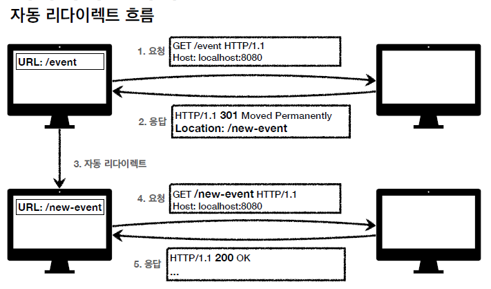
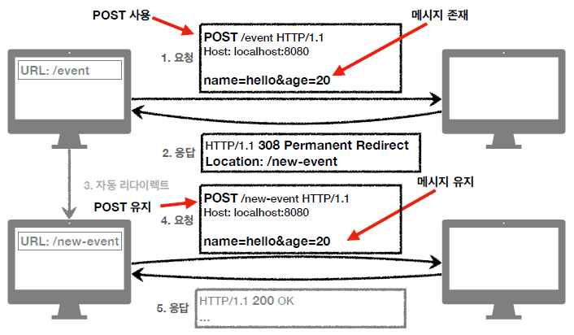
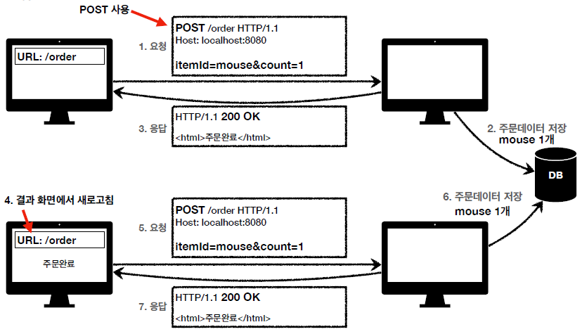
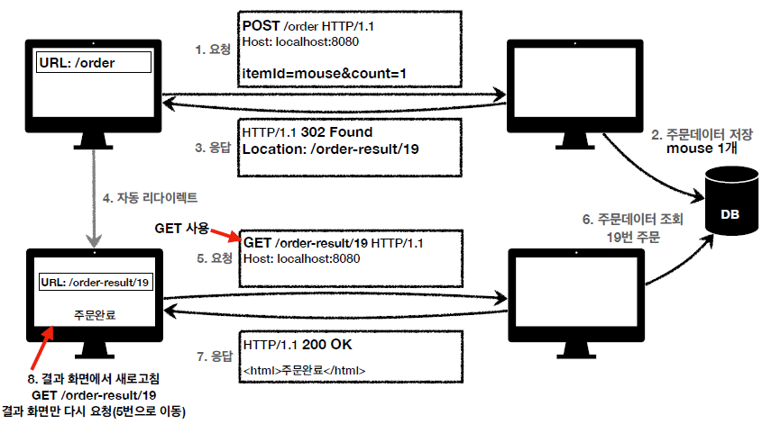

# HTTP 웹 기본 지식 5

## HTTP 상태 코드

HTTP 상태코드는 클라이언트가 보낸 요청의 처리 상태를 응답해서 알려주는 기능을 말한다.

- 1xx (Informational): 요청이 수신되어 처리중
- 2xx (Successful): 요청 정상 처리
- 3xx (Redirection): 요청을 완료하려면 추가 행동이 필요
- 4xx (Client Error): 클라이언트 오류, 잘못된 문법등으로 서버가 요청을 수행할 수 없음
- 5xx (Server Error): 서버 오류, 서버가 정상 요청을 처리하지 못함

만약 클라이언트가 인식할 수 없는 상태코드를 서버가 반환하더라도 클라이언트는 상위 상태코드로 해석하여 처리한다. 미래에 새로운 상태코드가 추가되더라도 클라이언트를 변경할 필요가 없어진다. 각 상태코드의 특징을 알아보자.

### 1xx : 거의 사용하지않으므로 생략

## 2xx (Successful)

- 200 OK : 서버가 클라이언트의 요청을 성공적으로 처리하면 200 상태코드를 전송한다.  

- 201 Created : 클라이언트의 요청을 성공해서 새로운 리소스가 만들어 졌을 때 전송한다.

- 202 Accepted : 요청이 접수되었으나 처리가 완료되지 않았을 경우

  - 배치처리 같은 곳에서 사용한다.(요청 접수 후 1시간 뒤에 배치 프로세스가 처리)

- 204 No Content : 서버가 요청을 성공적으로 수행했지만, 응답 페이로드 본문에 보낼 데이터가 없을 때
  - 게시글 내용을 자동저장하는 경우에 포함 : 자동저장 버튼을 누르더라도 서버에서 따로 보낼 메시지는 없어도 되며, 같은 하면을 유지해야함

## 3xx (Redirection)

3xx는 요청을 완료하기 위해 유저 에이전트의 추가 조치가 필요할 경우 사용한다. 그 전에 먼저 리다이렉트가 어떤 건지 알아보자. 먼저 리다이렉트가 무엇인지 그림으로 보자.

1. 클라이언트가 /event URI을 요청
2. 서버에서는 301 상태코드와 Location 헤더를 전송, Location에는 /new-event URI가 담겨있음.
3. 클라이언트는 자동으로 /new-event URI로 요청하게됨
4. 서버에서는 URI에 맞는 비즈니스 로직을 처리하고 200 상태코드 전송

만약 3xx 응답의 결과에 Location 헤더가 있으면 Location 위치로 자동이동하는데, 이를 리다이렉트라고 한다. 리다이렉트는 여러 종류가 있다.

- 영구 리다이렉션 (301, 308)

  - 리소스의 URI가 영구적으로 이동하게됨
  - 원래의 URL을 사용하지 않고, 검색엔진 등에서도 변경을 인지
  - 301 : Moved Permanently
    - 리다이렉트 시 **요청 메서드가 GET으로 변하고**, 본문이 제거될 수 있다.

  

  - 308 : Permanent Redirect
    - 301과 기능은 같다. 리다이렉트시 **요청 메서드와 본문을 유지**한다.(처음 POST를 보내면 리다이렉트도 POST방식을 유지한다.)

 

- 일시적 리다이렉션(302, 307, 303)
  - 리소스의 URI가 **일시적으로 변경**된다.
  - 검색엔진에서 URI를 변경하면 안된다.
  - 302 Found
    - 리다이렉트시 **요청 메서드가 GET으로 변하고**, 본문이 제거될 수 있다.
  - 307 Temporary Redirect
    - 302와 기능은 같다, 리다이렉트시 **요청 메서드와 본문을 유지**한다.(요청 메서드를 변경하면 안된다.)
  - 303 See Other
    - 302와 기능은 같다. 리다이렉트시 **요청 메서드가 GET으로 변경**된다.

 

### PRG: Post Redirect Get

일시적인 리다이렉션의 예시를 알아보자. POST방식으로 주문 후에 웹 브라우저를 새로고침하면 어떻게 될까? 새로고침은 주문을 다시 요청하기 때문에 중복 주문이 되어 문제가 생길 수 있다.

결과화면에서 새로고침을 하면 이전에 했던 요청을 다시하게되고, 서버는 DB에 해당 주문내역을 저장하게된다. 이럴 경우 중복 주문이 되어 클레임이 들어올 수 있고, 큰 문제가 될 수 있다. 이를 방지하기위해서 PRG를 사용한다. PRG를 사용하면 위의 중복주문을 방지할 수 있는데,

- POST로 주문 후 새로고침으로 인한 중복 주문을 방지
- POST로 주문 후에 주문 결과 화면을 GET메서드로 리다이렉트
- GET 메서드는 조회만 가능하도록 설계되므로 새로고침해도 결과화면이 조회만 된다.
- 중복 주문 대신 결과화면만 GET으로 다시 요청

PRG를 사용했을 경우의 과정이다. POST 방식이 GET 방식으로 변경되어 새로고침을 하더라도 주문 요청이 아닌 조회가 요청되어 응답으로 주문완료 데이터가 전송되는 것을 볼 수 있다.

일시적인 리다이렉션은 302, 307, 303 세 가지가 있다. 어떤 것을 써야될까? 각 특징을 살펴보면

- 302 Found -> GET으로 변할 수 있음
- 307 Temporary Redirect -> 메서드가 변하면 안됨
- 303 See Other -> 메서드가 GET으로 변경

원래 302의 의도는 HTTP 메서드를 유지하는 것이었다. 하지만 명확하게 명시가 되어있지 않아 웹 브라우저에서는 대부분 GET 방식으로 바꿔서 사용을 했다. 이를 명확히 하기위해 나중에 307, 303이 등장하게 되었다.

하지만 현실적으로 이미 많은 애플리케이션 라이브러리들이 302를 기본값으로 사용하기 때문에 GET으로 변해도 된다면 302를 사용해도 큰 문제는 없다.

 

### 기타 리다이렉션

- 304 : Not Modified
  - 캐시를 목적으로 사용하는 리다이렉션
  - 클라이언트에게 리소스가 수정되지 않았음을 알려주는 상태코드이다. 이를 통해 클라이언트는 로컬 PC에서 저장된 캐시를 재사용할 수 있게 된다. (가지고 있는 캐시 데이터가 서버에서 수정되었는지, 만료되었는지를 확인하기위해 사용)
  - 304 응답은 응답에 메시지 바디를 포함해서는 안된다.(로컬 캐시를 사용해야하기 때문)
  - 조건부 GET, HEAD 요청시에 사용한다.

 

## 4xx 클라이언트 오류

- 클라이언트의 요청에 잘못된 문법 등으로 서버가 요청을 수행하지 못함
- **오류의 원인이 클라이언트에 있음**
- 클라이언트가 이미 잘못된 요청, 데이터를 보내기 때문에 똑같은 재시도가 실패한다.

### 4xx 상태코드의 종류

- 400 Bad Request : 클라이언트가 잘못된 요청을 해서 서버가 요청을 처리할 수 없다. 클라이언트는 요청 내용을 다시 검토하고 보내야한다.

- 401 Unauthorized : 클라이언트가 해당 리소스에 대한 인증이 필요할 때
  - 인증되지가 않았을 때 보내는 상태코드
  - 응답에 WWW-Authenticate 헤더와 함께 인증방법을 설명한다.
  - 참고 : 인증(Authentication) = 본인이 누구인지 확인(로그인), 인가(Authorization) = 권한부여(특정 리소스에 접근할 수 있는 권한, 인증이 있어야 인가가 있다.)
- 403 Forbidden : 서버가 요청을 이해했지만 승인을 거부하는 경우
  - 인증 자격 증명은 있지만 접근권한이 불충분한 경우에 보내는 상태코드
- 404 Not Found : 요청 리소스를 찾을 수 없을 경우.
  - 말 그대로 리소스가 서버에 없다. 또는 클라이언트가 권한이 부족한 리소스에 접근할 때 해당 리소스를 숨기고 싶을 때 사용한다.

 

## 5xx 서버 오류

- 서버 문제로 오류가 발생
- **서버에 문제가 있기 때문에 재시도하면 성공할 수도 있음**(복구가 됐을 때 등)

### 5xx 상태코드의 종류

- 500 Internal Server Error : 서버 문제로 오류가 발생하는 경우, 애매하면 500 오류가 발생하게끔 한다.
- 503 Service Unavailable : 서비스 이용 불가.
  - 서버가 일시적인 과부하, 예정된 작업으로 잠시 요청을 처리할 수 있음
  - Retry-After 헤더 필드로 얼마 두에 복구되는지 보낼 수도 있다.

 

한 가지 알아야 할 점이라면 웬만해서는 서버 쪽 오류를 내지 않는 것이 좋다. 예를 들면 고객의 잔고가 부족할 때 서버 측 오류로 내면 안되고 클라이언트 오류로 내야한다. 고객의 잔고가 부족한 것이 서버에 문제가 있어서는 아니다.

20살 이상만 주문을 해야하는데 18살이 주문을 했을 때도 서버 측 오류로 내면 안되고 클라이언트 오류로 내야한다.

비즈니스 로직에 문제가 생겼을 때, DB서버에 문제가 생겼을 때 500 에러를 내야하지 **예외케이스가 나왔다고 해서 서버 측 오류가 났다고 상태코드를 보내서는 안된다.**
