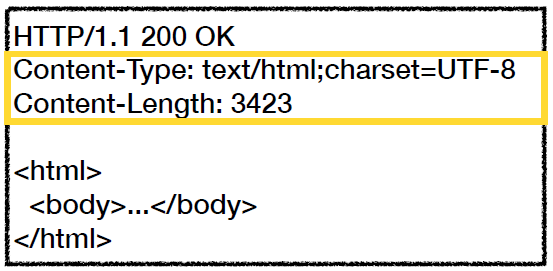
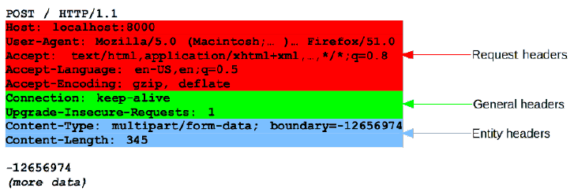
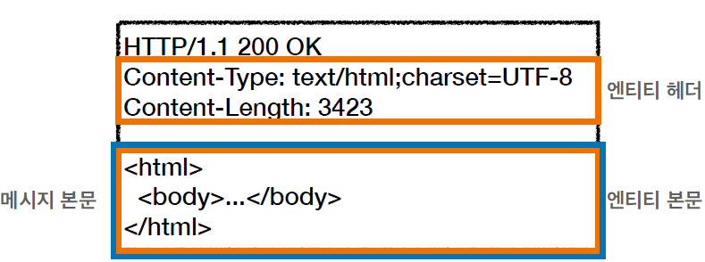
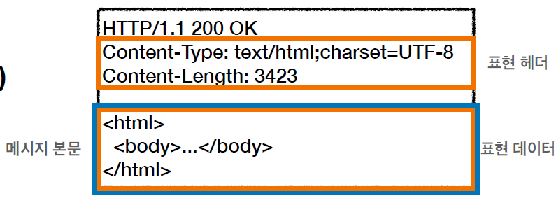
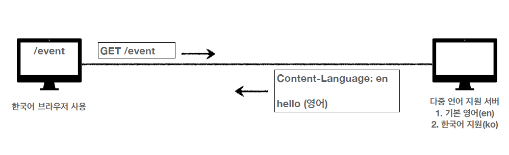
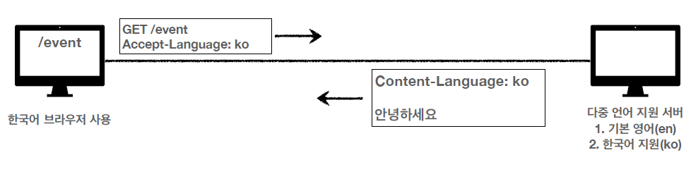
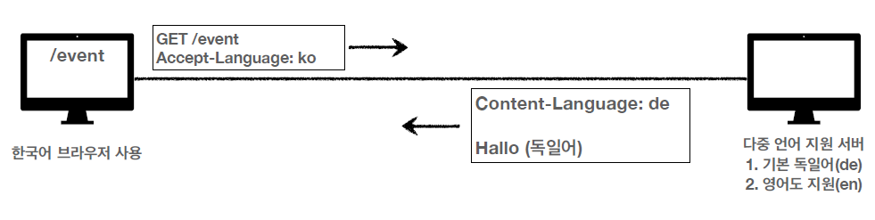
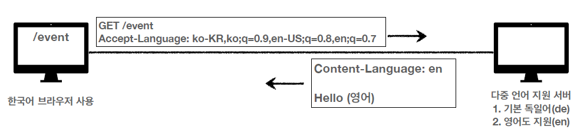
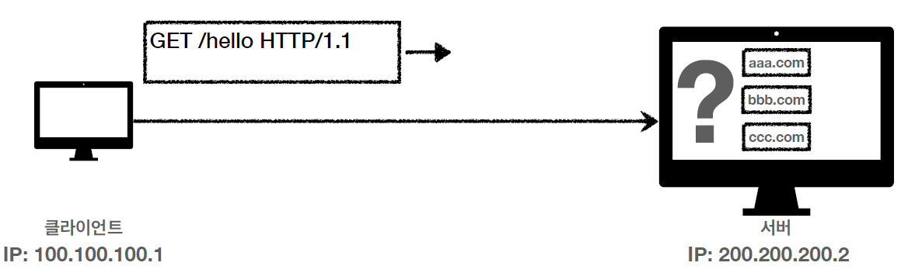

# HTTP 웹 기본 지식 6

## HTTP 헤더 자세히

HTTP 헤더는 HTTP 전송에 필요한 모든 부가정보들을 담은 구역이라고 말했었다. HTTP 헤더의 자세한 구조를 알아보자.

### 헤더의 분류(RFC2616 기준)

- General 헤더 : 메시지 전체에 적용되는 정보를 말한다. (Connection: close)
- Request 헤더 : 요청 클라이언트의 정보를 말한다.(User-Agent: Mozilla/5.0 ..)
- Response 헤더 : 응답 정보를 말한다. (Server: Apache)
- Entity 헤더 : 엔티티 바디의 정보를 말한다. (Content-Type: text/html; charset=UTF-8, Content-Length: 3423)

- 메시지 본문(Message Body)는 엔티티 본문(entity body)을 전달하는데 사용한다.
- 엔티티 본문은 요청이나 응답에서 전달할 실제 데이터가 담겨있다.
- 엔티티 헤더는 엔티티 본문의 데이터를 해석할 수 있는 정보를 제공한다.
  - 데이터 유형(html, json), 데이터 길이, 압축정보 등등을 제공한다.
- 메시지 본문이 엔티티 본문을 포함한다고 보면 된다.

원래는 이렇게 정의가 되어 있엇으나, **2014년에 RFC7230~7235 개정판이 등장**하게 된다. 변경사항은 다음과 같다.

- **엔티티(Entity)를 표현(Representation)으로 바꿈**
- 여기서 Representation = Representation Metadata + Representation Data 를 말한다.

- 메시지 본문(message body)을 통해 표현 데이터를 전달하게된다.
- 여기서 메시지 본문을 페이로드(payload)라고 한다.
- **표현은 요청이나 응답에서 전달할 실제 데이터**를 말한다.
- 또한 **표현헤더는 표현 데이터를 해석할 수 있는 정보를 제공**한다.
  - 데이터 유형(html, json), 데이터의 길이, 압축정보 등등을 제공한다.

 

### 표현

- Content-Type: 표현 데이터의 형식
  - 미디어 타입이나 문자 인코딩을 설명한다.
  - 예) "text/html; charset=UTF-8", "application/json", "image/png"
- Content-Encoding: 표현 데이터의 압축 방식
  - 표현한 데이터를 압축하기위해 사용한다.
  - 데이터를 전달하는 곳에서 압축 후에 인코딩 헤더를 추가
  - 데이터를 읽는 쪽에서 인코딩 헤더의 정보로 압축을 해제한다.
  - 예) Content-Encoding: gzip
- Content-Language: 표현 데이터의 자연언어
  - 표현 데이터의 자연 연어를 표현한다. (ko, en, en-US)
- Content-Length: 표현 데이터의 길이. 바이트 단위이다.
  - Transfer-Encoding(전송코딩)을 사용하면 Content-Length를 사용해서는 안된다.

그렇다면 엔티티에서 표현으로 말고 단어를 바꾼 이유는 무엇일까? 표현이라는 단어를 사용하게 된 이유는 HTTP헤더에서 어떤 Content type으로 요청/응답을 하느냐에 따라 HTML로 표현될 지, JSON으로 표현될 지, image로 표현될 지가 달라지기 때문에 표현이라는 단어를 사용하게 된 것이다.

 

## 협상(컨텐츠 네고시에이션)

협상은 클라이언트가 선호하는 표현을 요청하는 것이다. 핵심적으로 사용되는 4가지가 있다.

- Accept: 클라이언트가 선호하는 미디어 타입 전달
- Accept-Charset: 클라이언트가 선호하는 문자 인코딩
- Accept-Encoding: 클라이언트가 선호하는 압축 인코딩
- Accept-Language: 클라이언트가 선호하는 자연 언어

- 협상 헤더는 **요청 시에만 사용**한다.

그렇다면 클라이언트가 선호하는 표현은 무엇이고, 협상이라는 것은 어디에 쓰이는 지 알아보자. 다음은 Accept-Language를 예로 들어 설명한 것이다.

상황은 이렇다. 한국어 브라우저를 사용하는 클라이언트가 있고, 영어(기본)와 한국어를 지원하는 서버가 있다.

- 클라이언트가 GET방식으로 /event URI가 있는 페이지를 요청한다.
- 서버는 클라이언트의 요청을 받는다. 클라이언트 측에서 따로 이야기한게 없었으므로 기본언어인 영어로 메시지 바디를 전송한다.
- 클라이언트는 한국어 브라우저를 사용하지만 영어로 작성된 페이지를 보게 된다.

클라이언트는 한국어를 사용하기 때문에 한국어로 되어있는 페이지를 보길 원한다. 하지만 한국어로 페이지를 달라는 표현이 없었기 때문에 서버에서는 기본언어로 설정되있는 영어로 페이지를 보여주게 된다. 한국어를 원하는 클라이언트는 이제 다음과 같이 요청을 보낸다.

Accept-Language: ko 라는 HTTP 헤더 정보를 넣어서 요청을 보냈다. 서버는 이를 읽으면 클라이언트 측에서 한국어를 사용한다는 것을 인지하고 한국어로 되어있는 HTML 페이지로 응답하게된다.

한 가지 더 생각해보자, 만약 서버에서 한국어를 지원하지 않고, 독일어(기본), 영어만 지원한다면 어떻게 될까? 기본언어가 독일어로 되어있지만 한국인은 그래도 영어로 홈페이지를 보는 것이 차라리 나을 것이다. 하지만 Accept-Language를 ko로 보내면 서버에서는 지원하는 언어가 없기 때문에 기본언어인 독일어를 보여주게 된다. 이럴 땐 어떻게 해야될까?

 

## 협상과 우선순위

### Quality Values(q)

Quality Values는 여러 옵션들 중에 우선순위를 정하는 값이라고 보면 된다. Quality Values의 범위는 0~1이고, 클수록 높은 우선순위를 갖는다. 만약 생략하면 자동으로 1로 할당되어진다.

> Accept-Language: ko-KR,ko;q=0.9,en-US;q=0.8,en;q=0.7

우선순위는 다음과 같다.

1. ko-KR;q=1 (q 생략됨)
2. ko;q=0.9
3. en-US;q=0.8
4. en;q=0.7

우선순위를 이용해서 이제 위의 예시로 돌아가보자, 독일어보다는 영어가 나은 한국인 입장에서, Accept-Language에 우선순위를 정하면 서버에서는 독일어보다 영어를 선호하니 영어로 홈페이지를 불러오게 될 것이다.

 

### 협상과 우선순위2

위 처럼 Quality Values의 값을 할당하여 우선순위를 정할 수도 있다. 아니면 구체적인 명시를 통해서도 자동으로 우선순위가 정해지는 경우도 있다. 예시를 보자.

> Accept: text/\*, text/plain, text/plain;format=flowed, \*/\*

1. text/plain;format=flowed
2. text/plain
3. text/\*
4. \*/\*

우선순위는 구체적으로 쓴 순서대로이다. 1번부터4번 까지 봤을 때, 1번으로 갈 수록 보다 구체적으로 명시된 것을 볼 수 있다.

 

## 전송 방식

전송 방식은 크게 네 가지가 있다.

- 단순 전송: 말 그대로 따로 처리 과정을 거치지 않고 그대로 응답을 보낸다. 기본적으로 Content-Length를 포함하여 보낸다.

- 압축 전송: [Content-Encoding: gzip]과 같은 형태로 인코딩 압축하여 응답을 보내는 방식, 클라이언트에서 응답을 받으면 압축을 해제한 다음 데이터를 읽게 된다.

- 분할 전송: 데이터를 덩어리(chunked)로 나누어서 보내는 것을 말한다. Transfer-Encoding: chunked를 HTTP 헤더에 적어서 보낸다.

- 범위 전송: 클라이언트가 데이터를 받아가 중간에 끊겼을 때, 데이터를 다시 처음부터 끝까지 받는 것은 비효율적이므로 못받은 부분만 범위를 입력하여 요청을 보내면 서버가 범위만큼만 응답하여 데이터를 보내는 방식. Range: bytes=1001-2000과 같은 형식으로 보낸다.

### 일반 정보

- From: 유저 에이전트의 이메일 정보

  - 일반적으로 잘 사용되지 않는다.
  - 검색 엔진같은 곳에서 주로 사용한다.
  - 요청에서 사용된다.

- **Referer: 이전 웹 페이지 주소**

  - 현재 요청된 페이지의 이전 웹 페이지 주소를 말한다.
  - A > B로 이동하는 경우 B를 요청할 때 Referer: A를 포함해서 요청한다.
  - 요청에서 사용한다.
  - Referer같은 경우에는 포털사이트를 들어가서 f12를 누르고 Network에서 HTTP 메시지를 보면 바로 확인이 가능하다.

- User-Agent: 유저 에이전트 애플리케이션 정보

  > user-agent: Mozilla/5.0 (Macintosh; Intel Mac OS X 10_15_7) AppleWebKit/
  > 537.36 (KHTML, like Gecko) Chrome/86.0.4240.183 Safari/537.36

  - 클라이언트의 애플리케이션 정보(웹 브라우저 정보 등등)
  - 통계 정보
  - 어떤 종류의 브라우저에서 장애가 발생하는지 파악이 가능하다.
  - 요청에서 사용한다.

- Server: 요청을 처리하는 ORIGIN 서버의 소프트웨어 정보

  > Server: Apache/2.2.22(Debian)
  > server: nginx

  - 응답에서 사용한다.

- Date: 메시지가 발생한 날짜와 시간
  - Date: Tue, 15 Nov 1994 08:12:31 GMT
  - 응답에서 사용한다.

 

### 특별한 정보

- Host: 요청한 호스트의 정보(도메인)
  - **요청에서 사용(필수값)**
  - 하나의 서버가 여러 도메인을 처리해야할 때 사용
  - 하나의 IP주소에 여러 도메인이 적용되어 있을 때 사용

호스트는 서버에서 가상 도메인을 활용하여 여러 개의 가상 호스트를 사용할 때, 어떤 호스트로 요청을 보내는 지를 서버가 구분할 때 필요하다. 요청에서의 필수값이므로 서버는 이 값을 보고 어떤 호스팅으로 보내야할 지를 판단하게된다.

- Location: 페이지 리다이렉션
  - 웹 브라우저는 3xx 응답의 결과에 Location 헤더가 있으면 Location 위치로 자동이동하게 된다(리다이렉트) : 응답코드 3xx에서 설명한 바 있음
  - 201 (Created) 상태코드의 경우 Location 값은 요청에 의해 생성된 리소스 URI이다.
  - 3xx (Redirection): Location 값은 요청을 자동으로 리다이렉션하기 위한 대상 리소스를 가리킨다.
- Allow: 허용 가능한 HTTP 메서드
  - 405 (Method Not Allowed)에서 응답에 포함해야한다.
    > Allow: GET, HEAD, PUT
- Retry-After: 유저 에이전트가 다음 요청을 하기까지 기다려야하는 시간

  - 503(Service Unavailable) : 서비스가 언제까지 불능인지 알려줄 수 있다.

    > Retry-After: Fri, 31 Dec 1999 23:59:59 GMT (날짜 표기)

    > Retry-After: 120 (초단위 표기)

- Authorization: 클라이언트 인증 정보를 서버에 전달하는 것

  - Authorization: Basic xxxxxxxxxxx

- WWW-Authenticate: 리소스 접근 시 필요한 인증 방법을 정의함
  - 401 Unauthorized 응답과 함께 사용한다.
    > WWW-Authenticate: Newauth realm="apps", type=1, title="Login to \"apps\"", Basic realm="simple"
