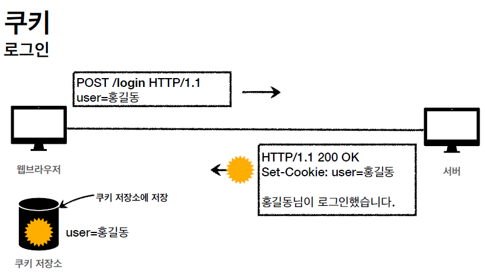

# HTTP 웹 기본 지식 7

## 쿠키

- Set-Cookie: 서버에서 클라이언트로 쿠키를 전달한다.(응답)
- Cookie: 클라이언트가 서버에서 받은 쿠키를 저장하고, HTTP 요청 시 서버로 전달한다.

쿠키는 어떤 상황에서 사용되는지 아래 사진을 보고 확인해보자.

다음은 쿠키를 사용하지 않았을 때의 상황이다. POST 방식으로 /login URI에 user를 홍길동으로 하는 요청을 클라이언트에서 보냈을 때, 서버에서는 홍길동님이 로그인했다는 OK 응답메시지를 보내게 된다. "안녕하세요. 손님"이라는 문자를 출력한다.

로그인이 된 것을 확인하고 /welcome 페이지로 이동했으나, 서버에서는 "안녕하세요, 손님"으로 메시지가 바꿔진 것을 확인할 수 있다.

이유는 HTTP의 Stateless때문이다. 무상태 프로토콜이기 때문에 서버와 클라이언트가 요청을 주고받으면 연결이 끊어지게 되므로, 클라이언트가 서버에 욫어을 하면 서버는 이전 요청을 기억하지 못하게 되는 것이다.

이를 해결하기 위해 클라이언트에서 GET을 통해 쿼리파라미터에 user=홍길동이라는 데이터를 넘겨서 "안녕하세요, 홍길동님"을 출력시키려고 한다. 과연 이것이 올바른 해결책이라고 할 수 있을까?

이런 문제를 해결하기 위해서 쿠키라는 개념이 등장하였다. 이제 쿠키를 사용하여 로그인처리를 어떻게 하는지 사진으로 보자.

클라이언트가 POST 방식으로 user=홍길동 이라는 메시지를 서버에 전송하면 서버는 Set-Cookie: user=홍길동 을 통해 쿠키를 클라이언트에 전송하는 것을 볼 수 있다. 클라이언트는 받은 쿠키를 쿠키 저장소에 저장하게 된다.

다른 URI로 이동할 때 클라이언트는 서버에 쿠키를 전송한다. 쿠키를 받은 서버는 쿠키 데이터정보를 읽고, 비즈니스 로직을 처리하면서 홍길동이 로그인 되었다는 메시지를 출력하게된다.

 

## 쿠키

> set-cookie: sessionId=abcde1234; expires=Sat, 26-Dec-2020 00:00:00 GMT; path=/; domain=.google.com; Secure

- 쿠키의 사용처

  - 사용자 로그인 세션 관리
  - 광고 정보 트래킹(선호하는 광고가 어떤건지 체크)

- 쿠키 정보는 항상 서버에 전송되는 것이 특징이다.

  - 네트워크 트래픽을 추가적으로 유발한다.
  - 따라서 최소한의 정보만 사용해야한다(세션 ID, 인증토큰 등)
  - 서버에 전송하지않고 웹 브라우저 내부에 데이터를 저장하고 싶으면 웹 스토리지를 참고하는 것이 좋다(localStorage, sessionStorage)

- **보안에 민감한 데이터는 저장해선 안된다(주민번호, 신용카드 등)**

 

## 쿠키 - 생명주기

- Set-Cookie: **expires**=Sat, 26-Dec-2020 04:39:21 GMT

  - 만료일이 되면 쿠키가 삭제된다. (날짜를 기준으로 생명주기 설정)

- Set-Cookie: **max-age**=3600 (3600초)
  - 0이나 음수를 지정하면 쿠키가 삭제된다. (시간을 기준으로 생명주기 설정)

쿠키의 생명주기 종류는 2 가지가 있다. 세션쿠키는 만료 날짜를 생략하면 브라우저 종료 시 까지만 유지되는 쿠키이고, 영속 쿠키는 만료 날짜를 입력하면 해당 날짜까지 유지되는 생명주기이다.

 

## 쿠키 - 도메인

> domain=example.org

- 도메인을 명시하면 명시한 문서를 기준으로 도메인과 서브도메인을 포함하여 쿠키가 사용될 수 있다.

  - 위의 예시를 기준으로 보면 example.org는 물론 dev.example.org도 쿠키 접근이 가능하다.

- 도메인을 생략하면 현재 문서 기준 도메인만 적용된다.
  - example.org에서 쿠키를 생성하고 domain 지정을 생략할 경우에는 example.org에서만 쿠키 접근이 가능하다. dev.example.org에서는 불가능하다.

 

## 쿠키 - 경로

> path=/home

- 이 **경로를 포함한 하위 경로 페이지만** 쿠키에 접근이 가능

- 일반적으로 path=/ 루트로 지정한다.

  

## 쿠키 - 보안

- Secure : 쿠키는 http, https 구분하지 않고 전송하는데 Secure를 적용하면 https인 경우에만 전송한다.
- HttpOnly : XSS 공격을 방지하기위해서 사용, JS에서 접근이 불가하다. HTTP 전송에만 사용된다.
- SameSite : XSRF공격을 방지하고 요청 도메인과 쿠키에 설정된 도메인이 같은 경우만 쿠키를 전송한다.
