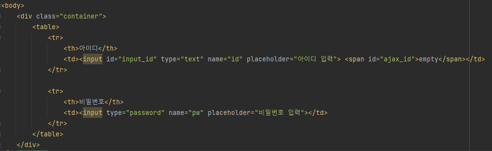
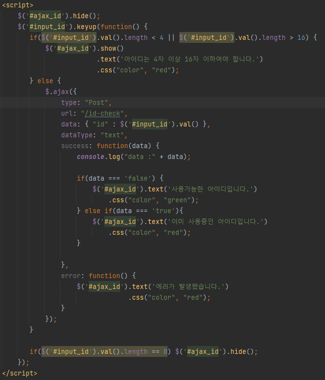
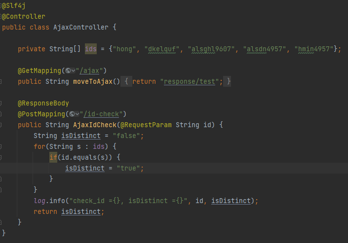

# AJAX 사용하여 아이디 중복체크하기(스프링부트)

곧 JSP 프로젝트가 시작된다. 시작하기 전에 AJAX에 대해 알아보고 어떻게 사용하는지 익히기 위해서 글을 작성하였다.

AJAX의 개념적인 부분은 이미 구글링을 하면 다 나와있기에 여기서 자세히 설명하지는 않을 것이다. 이 글에서는 AJAX를 통해 아이디 중복확인을 하는 로직을 간단하게 구현하는 방법에 대해서 초점을 맞출 생각이다.

일단 DB연동같은건 하지 않았다. 그냥 Controller에 String 배열로 임의의 아이디 여러 개를 생성해놓고, 클라이언트가 ID를 입력할 때 String 배열에 있는 값과 일치할 경우 실행될 로직을 작성해보았다. 스프링 부트로 구현해보았다.

 

1. test.html

그냥 아이디와 비밀번호가 존재하는 단순한 HTML 파일이다. input 입력란 옆에 span태그를 숨겨놓고 텍스트를 입력할 때 로직이 실행되도록 했다.

 

2. JavaScript

로직을 요약하자면 다음과 같다.

- 먼저 span 태그를 숨긴다.

- 아이디 input 태그에 아이디를 입력할 때마다 함수가 실행되는 keyup을 사용하였다. 텍스트 길이가 4미만 또는 16 이상일 때 span 태그로 조건에 만족하지 않는 멘트를 날리도록 코드를 작성했다.

- 만약 길이가 4 이상 16 이하라면 ajax로 서버와 통신한다. post방식으로 입력한 아이디를 서버로 전송하고, url은 "/id-check"으로 설정한다. 받는 데이터 타입은 간단하게 text로 하였다. json형식으로도 받을 수 있고, 스프링부트에서 json으로 데이터를 반환하는 기능들을 지원하지만 간단하게 구현하기위해 text로 하였다.

- success는 데이터를 성공적으로 받았을 때 실행되는 함수이다. 받은 데이터가 false이면 사용가능한 아이디, true이면 이미 사용중인 아이디라고 멘트가 나오도록 했다.

처음 사용할 때는 삽질을 엄청했다. 특히 데이터를 넘기는 부분. 사실 ajax를 처음 쓴다기 보다는 jQuery가 익숙치 않아서 삽질이 길어진 것 같다. 데이터를 넘길 때는 data에 값을 넣고, 데이터를 받을 때는 success의 function 파라미터로 받아오기 때문에 이 부분을 혼동하면 안된다.

 

3. Controller

- 먼저 이미 등록된 아이디를 ids 배열에 저장했다(임의로 작성). 입력한 아이디가 ids에 있는 아이디와 일치할 경우 이미 사용중인 아이디가 된다.

- AJAX의 url을 "/id-check"으로 설정했다. @PostMapping("/id-check")으로 데이터가 들어오게 되고, 여기서 로직이 실행된다. @RequestParam으로 입력값을 받아오도록 했다. AJAX부분을 보면 JSON 형식으로 key는 id, value는 입력값으로 되어있었다.

- ids 배열을 for문으로 돌려서 만약 입력값과 일치하는 아이디가 나오면 아이디가 중복되므로 리턴할 isDistinct 변수를 true로 설정한다. 아닐 경우는 false로 설정한다.

이 부분이 제일 스트레스 받았던 구간, 아직 스프링 부트를 배운지 얼마 안됐고, @RequestBody와 @RequestParam이 헷갈려서 데이터 값이 이상하게 오는 줄도 모르고 다른 코드를 고치고 있었다.

@RequestBody는 GET이나 POST 방식이 아닐 때 사용해야하는 애노테이션이다. 정확히 말하면 쿼리파라미터로 오는 데이터가 아닐 때 사용해야한다. 모델 객체를 사용할 때 사용하는 것이 좋다. 모델 객체의 필드변수와 읽어오는 데이터의 key 값이 일치하면 모델 객체로 바인딩을 해주는 방식인데, 이를 깜빡하고 @RequestBody를 사용해서 시간이 엄청 오래걸렸다.

@RequestParam은 쿼리파라미터로 값을 가져올 때 사용한다. AJAX로 보내는 값의 key가 id이므로 메서드 파라미터의 변수명도 id로 일치시키면 스프링부트는 둘의 이름이 같으므로 바인딩을 할 수 있는 명분이 생기게 된다. 따라서 Model 객체가 아닌 이상은 @RequestBody를 사용하는 것이 좋다. 하지만 보낼 때 데이터형식은 JSON이였는데.. 스프링부트에서 HashMap으로 인식한건지.. 이건 좀 더 알아봐야할 것 같다.

@ModelAttribute 애노테이션도 있다. 하지만 이 애노테이션은 쿼리파라미터를 받을 때 사용하는 Model 객체이므로 여기서는 예외.

 

# 결과

프로젝트를 한다면 정규식으로 아이디 양식을 제한하는 코드를 만들어보고 싶다. 일단 AJAX의 기본적인 기능에 대해서 알 수 있었으므로 만족한다. 비동기로 기능을 구현하는게 굉장히 편한 것 같다. 나중에는 게시판 페이징을 비동기로 이동하는 것도 구현해보고 싶은 생각이 든다.
